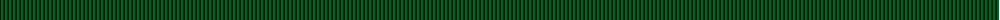
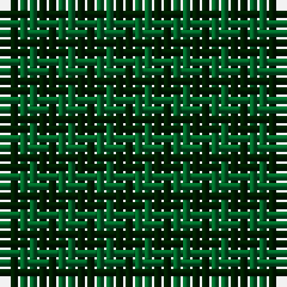

The parent of this is [MacKillen Hunting](/tartans/dg/2/g/2/)

This was sourced from register-of-tartans.  It is a [2 stripes tartan](/stripes/stripes2/).

Original link https://www.tartanregister.gov.uk/tartanDetails.aspx?ref=2537

## Thread count
DG/2 G/2

## Palette
DG G

# Sample pattern

ID: /variants/dg/2/g/2-dg001e00-g006428/
