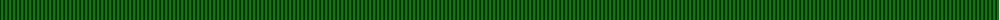
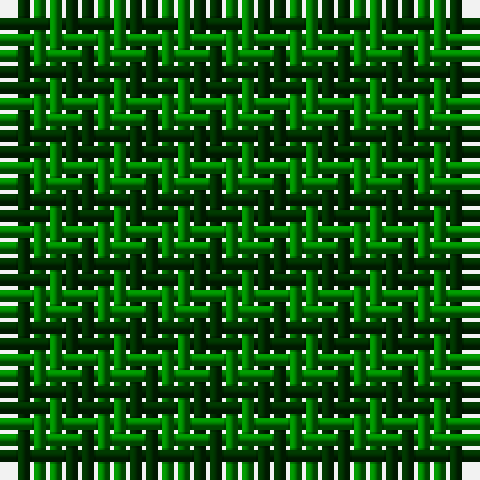

The parent of this is [Wilson's, No 219](/tartans/dg/2/g/2/)

This was sourced from weddslist.  It is a [2 stripes tartan](/stripes/stripes2/).

Original link http://www.weddslist.com/cgi-bin/tartans/pg.pl?source=sts

## Thread count
DG/2 G/2

## Palette
Each colour and its ΔE from the base-6 reference it is a variant of.

| Colour | Shade | Base | ΔE (OKLab) |
|---|---|---|---|
| DG |  `#003000` | G  | 0.18 |
| G |  `#008000` | G  | 0.09 |

# Sample pattern

ID: /variants/dg/2/g/2-dg003000-g008000/
