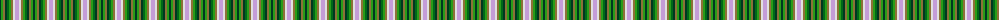

The parent of this is [Stirling Millennium (Corporate)](/tartans/dg/2/g2/lt2/dg2/ga2/g2/lt2/ln2/lp/4/)

This was sourced from tartans-authority.  It is a [9 stripes tartan](/stripes/stripes9/).

Original link http://www.tartansauthority.com/tartan-ferret/display/2686/

## Thread count
DG/2 G2 LT2 DG2 Ga2 G2 LT2 LN2 LP/4

## Palette
Each colour and its ΔE from the base-6 reference it is a variant of.

| Colour | Shade | Base | ΔE (OKLab) |
|---|---|---|---|
| DG |  `#003820` | G  | 0.16 |
| G |  `#289C18` | G  | 0.18 |
| Ga |  `#006818` | G  | 0.02 |
| LN |  `#E0E0E0` | W  | 0.06 |
| LP |  `#C49CD8` | W  | 0.24 |
| LT |  `#8C7038` | G  | 0.18 |

ID: /variants/dg/2/g2/lt2/dg2/ga2/g2/lt2/ln2/lp/4-dg003820-g289c18-ga006818-lne0e0e0-lpc49cd8-lt8c7038/
