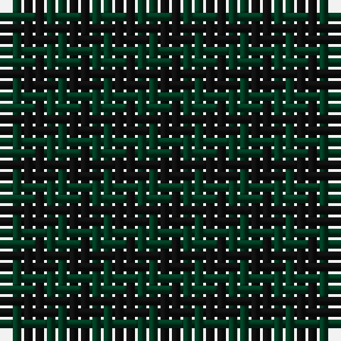

The parent of this is [Robin Hood/Wilson no.224/Rob Roy Hunting](/tartans/dg/2/k/2/)

This was sourced from register-of-tartans.  It is a [2 stripes tartan](/stripes/stripes2/).

Original link https://www.tartanregister.gov.uk/tartanDetails.aspx?ref=3537

## Thread count
DG/2 K/2

## Palette
DG K

# Sample pattern

ID: /variants/dg/2/k/2-dg003820-k101010/
