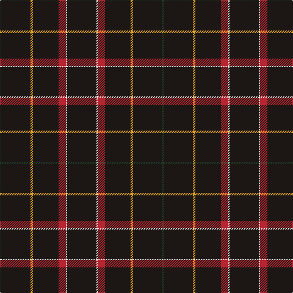

The parent of this is [Gourlay, George (Personal)](/tartans/dg/2/k48/y4/k42/r12/w2/k/48/)

This was sourced from register-of-tartans.  It is a [7 stripes tartan](/stripes/stripes7/).

Original link https://www.tartanregister.gov.uk/tartanDetails.aspx?ref=10266

## Thread count
DG/2 K48 Y4 K42 R12 W2 K/48

## Palette
Each colour and its ΔE from the base-6 reference it is a variant of.

| Colour | Shade | Base | ΔE (OKLab) |
|---|---|---|---|
| DG |  `#1E492B` | G  | 0.11 |
| K |  `#1C1714` | K  | 0.21 |
| R |  `#B62531` | R  | 0.04 |
| W |  `#F9F5EF` | W  | 0.01 |
| Y |  `#E0A126` | Y  | 0.08 |

# Sample pattern

ID: /variants/dg/2/k48/y4/k42/r12/w2/k/48-dg1e492b-k1c1714-rb62531-wf9f5ef-ye0a126/
