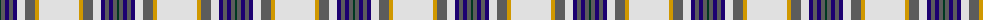

The parent of this is [Boucherville Dress (District)](/tartans/dg/2/n4/db4/n4/db4/ln8/n10/dy4/ln/40/)

This was sourced from tartans-authority.  It is a [9 stripes tartan](/stripes/stripes9/).

Original link http://www.tartansauthority.com/tartan-ferret/display/2118/

## Thread count
DG/2 N4 DB4 N4 DB4 LN8 N10 DY4 LN/40

## Palette
Each colour and its ΔE from the base-6 reference it is a variant of.

| Colour | Shade | Base | ΔE (OKLab) |
|---|---|---|---|
| DB |  `#1C0070` | B  | 0.14 |
| DG |  `#003820` | G  | 0.16 |
| DY |  `#D09800` | Y  | 0.11 |
| LN |  `#E0E0E0` | W  | 0.06 |
| N |  `#5C5C5C` | B  | 0.14 |

ID: /variants/dg/2/n4/db4/n4/db4/ln8/n10/dy4/ln/40-db1c0070-dg003820-dyd09800-lne0e0e0-n5c5c5c/
