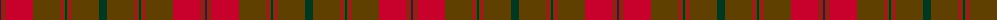

The parent of this is [Frame - Ferniegair (Personal)](/tartans/dg/2/r2/t2/r28/t28/r2/t2/dg2/t2/r2/t28/dg/8/)

This was sourced from tartans-authority.  It is a [12 stripes tartan](/stripes/stripes12/).

Original link http://www.tartansauthority.com/tartan-ferret/display/10614/

## Thread count
DG/2 R2 T2 R28 T28 R2 T2 DG2 T2 R2 T28 DG/8

## Palette
Each colour and its ΔE from the base-6 reference it is a variant of.

| Colour | Shade | Base | ΔE (OKLab) |
|---|---|---|---|
| DG |  `#003820` | G  | 0.16 |
| R |  `#C8002C` | R  | 0.03 |
| T |  `#604000` | G  | 0.14 |

ID: /variants/dg/2/r2/t2/r28/t28/r2/t2/dg2/t2/r2/t28/dg/8-dg003820-rc8002c-t604000/
