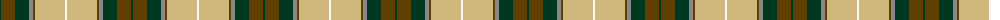
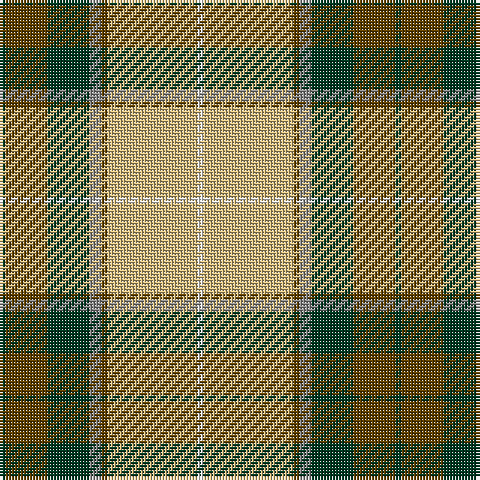

The parent of this is [Regalia (Fashion)](/tartans/dg/2/t14/dg14/n4/t2/lg30/w/2/)

This was sourced from tartans-authority.  It is a [7 stripes tartan](/stripes/stripes7/).

Original link http://www.tartansauthority.com/tartan-ferret/display/5418/

## Thread count
DG/2 T14 DG14 N4 T2 LG30 W/2

## Palette
Each colour and its ΔE from the base-6 reference it is a variant of.

| Colour | Shade | Base | ΔE (OKLab) |
|---|---|---|---|
| DG |  `#003820` | G  | 0.16 |
| LG |  `#D0B87C` | Y  | 0.09 |
| N |  `#888888` | R  | 0.24 |
| T |  `#604000` | G  | 0.14 |
| W |  `#F8F8F8` | W  | 0.01 |

# Sample pattern

ID: /variants/dg/2/t14/dg14/n4/t2/lg30/w/2-dg003820-lgd0b87c-n888888-t604000-wf8f8f8/
