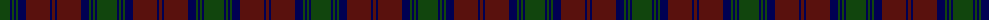

The parent of this is [Lindsay](/tartans/dg/20/db2/dg2/db2/dg2/db8/dr24/db2/dr/3/)

This was sourced from weddslist.  It is a [9 stripes tartan](/stripes/stripes9/).

Original link http://www.weddslist.com/cgi-bin/tartans/pg.pl?source=x

## Thread count
DG/20 DB2 DG2 DB2 DG2 DB8 DR24 DB2 DR/3

## Palette
Each colour and its ΔE from the base-6 reference it is a variant of.

| Colour | Shade | Base | ΔE (OKLab) |
|---|---|---|---|
| DB |  `#000052` | B  | 0.20 |
| DG |  `#11450D` | G  | 0.10 |
| DR |  `#59110D` | B  | 0.21 |

ID: /variants/dg/20/db2/dg2/db2/dg2/db8/dr24/db2/dr/3-db000052-dg11450d-dr59110d/
