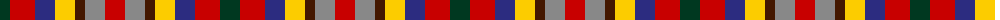

The parent of this is [Krifa-Jean (Personal)](/tartans/dg/20/r25/db20/y20/dr10/n20/ra/20/)

This was sourced from tartans-authority.  It is a [7 stripes tartan](/stripes/stripes7/).

Original link http://www.tartansauthority.com/tartan-ferret/display/11232/

## Thread count
DG/20 R25 DB20 Y20 DR10 N20 Ra/20

## Palette
Each colour and its ΔE from the base-6 reference it is a variant of.

| Colour | Shade | Base | ΔE (OKLab) |
|---|---|---|---|
| DB |  `#2C2C80` | B  | 0.05 |
| DG |  `#003820` | G  | 0.16 |
| DR |  `#441800` | B  | 0.22 |
| N |  `#888888` | R  | 0.24 |
| R |  `#C80000` | R  | 0.00 |
| Ra |  `#C80000` | R  | 0.00 |
| Y |  `#FCCC00` | Y  | 0.04 |

# Sample pattern

ID: /variants/dg/20/r25/db20/y20/dr10/n20/ra/20-db2c2c80-dg003820-dr441800-n888888-rc80000-rac80000-yfccc00/
