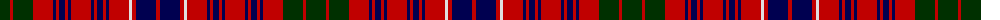

The parent of this is [MacRae of Conchra](/tartans/dg/20/r3/dg20/r20/db3/r3/db6/r3/db3/r20/db3/r3/db6/r3/db3/r20/ln3/r4/db20/r/4/)

This was sourced from weddslist.  It is a [20 stripes tartan](/stripes/stripes20/).

Original link http://www.weddslist.com/cgi-bin/tartans/pg.pl?source=sts

## Thread count
DG/20 R3 DG20 R20 DB3 R3 DB6 R3 DB3 R20 DB3 R3 DB6 R3 DB3 R20 LN3 R4 DB20 R/4

## Palette
Each colour and its ΔE from the base-6 reference it is a variant of.

| Colour | Shade | Base | ΔE (OKLab) |
|---|---|---|---|
| DB |  `#000050` | B  | 0.20 |
| DG |  `#003000` | G  | 0.18 |
| LN |  `#E0E0E0` | W  | 0.06 |
| R |  `#C00000` | R  | 0.02 |

ID: /variants/dg/20/r3/dg20/r20/db3/r3/db6/r3/db3/r20/db3/r3/db6/r3/db3/r20/ln3/r4/db20/r/4-db000050-dg003000-lne0e0e0-rc00000/
