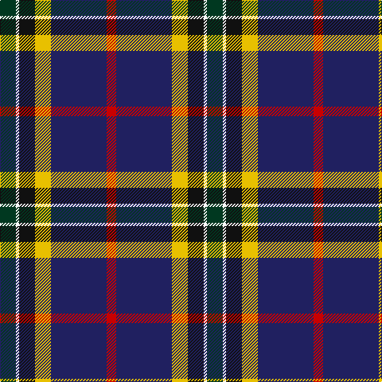

The parent of this is [Hatfield & Mize (Personal)](/tartans/dg/20/w4/k20/y20/db70/r/12/)

This was sourced from tartans-authority.  It is a [6 stripes tartan](/stripes/stripes6/).

Original link http://www.tartansauthority.com/tartan-ferret/display/10956/

## Thread count
DG/20 W4 K20 Y20 DB70 R/12

## Palette
Each colour and its ΔE from the base-6 reference it is a variant of.

| Colour | Shade | Base | ΔE (OKLab) |
|---|---|---|---|
| DB |  `#202060` | B  | 0.11 |
| DG |  `#003820` | G  | 0.16 |
| K |  `#101010` | K  | 0.17 |
| R |  `#C80000` | R  | 0.00 |
| W |  `#FCFCFC` | W  | 0.03 |
| Y |  `#E8C000` | Y  | 0.00 |

# Sample pattern

ID: /variants/dg/20/w4/k20/y20/db70/r/12-db202060-dg003820-k101010-rc80000-wfcfcfc-ye8c000/
