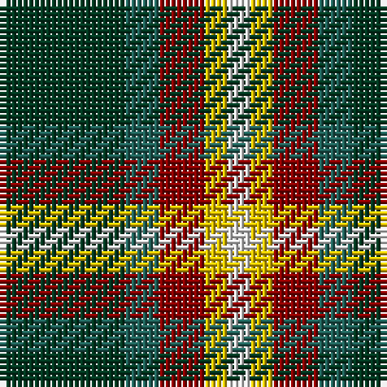

The parent of this is [Phinn Personal Tartan Tartan Number: 7104. Earliest known date: 2005 Anthony Thomson designed this tartan to make a silk stole in 2005. He returned in 2007 to have a kilt made up in heavyweight wool. See products available Copyright © Blair Urquhart, Comrie, 2015](/tartans/dg/22/g6/dr8/y4/ln/4/)

This was sourced from house-of-tartan.  It is a [5 stripes tartan](/stripes/stripes5/).

Original link http://www.house-of-tartan.scotland.net/house/TartanViewjs.asp?colr=Def&tnam=7104

## Thread count
DG/22 G6 DR8 Y4 LN/4

## Palette
Each colour and its ΔE from the base-6 reference it is a variant of.

| Colour | Shade | Base | ΔE (OKLab) |
|---|---|---|---|
| DG |  `#003820` | G  | 0.16 |
| DR |  `#880000` | R  | 0.14 |
| G |  `#206058` | G  | 0.11 |
| LN |  `#E0E0E0` | W  | 0.06 |
| Y |  `#E8C000` | Y  | 0.00 |

# Sample pattern

ID: /variants/dg/22/g6/dr8/y4/ln/4-dg003820-dr880000-g206058-lne0e0e0-ye8c000/
