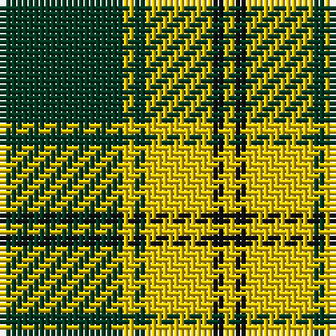

The parent of this is [Big Spruce Brewing](/tartans/dg/22/y2/dg2/y12/k2/y/2/)

This was sourced from tartans-authority.  It is a [6 stripes tartan](/stripes/stripes6/).

Original link http://www.tartansauthority.com/tartan-ferret/display/11025/

## Thread count
DG/22 Y2 DG2 Y12 K2 Y/2

## Palette
Each colour and its ΔE from the base-6 reference it is a variant of.

| Colour | Shade | Base | ΔE (OKLab) |
|---|---|---|---|
| DG |  `#003820` | G  | 0.16 |
| K |  `#101010` | K  | 0.17 |
| Y |  `#E8C000` | Y  | 0.00 |

# Sample pattern

ID: /variants/dg/22/y2/dg2/y12/k2/y/2-dg003820-k101010-ye8c000/
