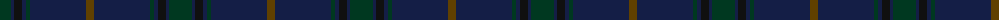

The parent of this is [Tern House](/tartans/dg/23/db3/k8/db4/dg4/db56/t/8/)

This was sourced from register-of-tartans.  It is a [7 stripes tartan](/stripes/stripes7/).

Original link https://www.tartanregister.gov.uk/tartanDetails.aspx?ref=11247

## Thread count
DG/23 DB3 K8 DB4 DG4 DB56 T/8

## Palette
Each colour and its ΔE from the base-6 reference it is a variant of.

| Colour | Shade | Base | ΔE (OKLab) |
|---|---|---|---|
| DB |  `#141E46` | B  | 0.15 |
| DG |  `#003820` | G  | 0.16 |
| K |  `#101010` | K  | 0.17 |
| T |  `#604000` | G  | 0.14 |

# Sample pattern

ID: /variants/dg/23/db3/k8/db4/dg4/db56/t/8-db141e46-dg003820-k101010-t604000/
