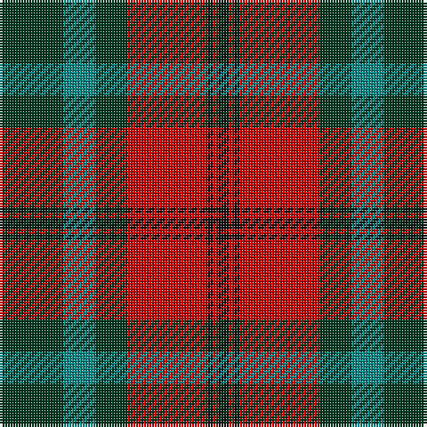

The parent of this is [Cook (Name)](/tartans/dg/24/b12/dg12/r30/k2/r2/k/4/)

This was sourced from tartans-authority.  It is a [7 stripes tartan](/stripes/stripes7/).

Original link http://www.tartansauthority.com/tartan-ferret/display/3403/

## Thread count
DG/24 B12 DG12 R30 K2 R2 K/4

## Palette
Each colour and its ΔE from the base-6 reference it is a variant of.

| Colour | Shade | Base | ΔE (OKLab) |
|---|---|---|---|
| B |  `#048888` | G  | 0.18 |
| DG |  `#003820` | G  | 0.16 |
| K |  `#101010` | K  | 0.17 |
| R |  `#C80000` | R  | 0.00 |

# Sample pattern

ID: /variants/dg/24/b12/dg12/r30/k2/r2/k/4-b048888-dg003820-k101010-rc80000/
