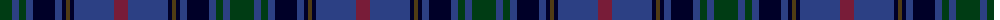

The parent of this is [Brethwe Powys](/tartans/dg/24/b7/dg7/b7/db22/b7/db4/t4/db4/b40/dr/14/)

This was sourced from register-of-tartans.  It is a [11 stripes tartan](/stripes/stripes11/).

Original link https://www.tartanregister.gov.uk/tartanDetails.aspx?ref=5846

## Thread count
DG/24 B7 DG7 B7 DB22 B7 DB4 T4 DB4 B40 DR/14

## Palette
Each colour and its ΔE from the base-6 reference it is a variant of.

| Colour | Shade | Base | ΔE (OKLab) |
|---|---|---|---|
| B |  `#2C4084` | B  | 0.00 |
| DB |  `#000028` | K  | 0.15 |
| DG |  `#003C14` | G  | 0.14 |
| DR |  `#781C38` | R  | 0.17 |
| T |  `#503C14` | G  | 0.15 |

ID: /variants/dg/24/b7/dg7/b7/db22/b7/db4/t4/db4/b40/dr/14-b2c4084-db000028-dg003c14-dr781c38-t503c14/
