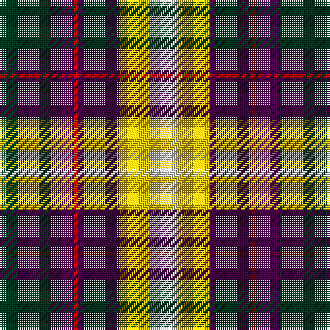

The parent of this is [Connelly, James (Personal)](/tartans/dg/24/dp12/r2/dp12/dp8/ya16/ln4/y/4/)

This was sourced from tartans-authority.  It is a [8 stripes tartan](/stripes/stripes8/).

Original link http://www.tartansauthority.com/tartan-ferret/display/10151/

## Thread count
DG/24 DP12 R2 DP12 DP8 Ya16 LN4 Y/4

## Palette
Each colour and its ΔE from the base-6 reference it is a variant of.

| Colour | Shade | Base | ΔE (OKLab) |
|---|---|---|---|
| DG |  `#003820` | G  | 0.16 |
| DP |  `#440044` | B  | 0.17 |
| LN |  `#E0E0E0` | W  | 0.06 |
| R |  `#C80000` | R  | 0.00 |
| Y |  `#E8C000` | Y  | 0.00 |
| Ya |  `#E8C000` | Y  | 0.00 |

# Sample pattern

ID: /variants/dg/24/dp12/r2/dp12/dp8/ya16/ln4/y/4-dg003820-dp440044-lne0e0e0-rc80000-ye8c000-yae8c000/
