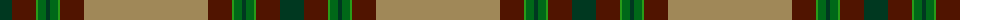

The parent of this is [Roast Den, The](/tartans/dg/24/dr24/ga2/g8/dg4/g8/ga2/dr24/lt/124/)

This was sourced from tartans-authority.  It is a [9 stripes tartan](/stripes/stripes9/).

Original link http://www.tartansauthority.com/tartan-ferret/display/11256/

## Thread count
DG/24 DR24 Ga2 G8 DG4 G8 Ga2 DR24 LT/124

## Palette
Each colour and its ΔE from the base-6 reference it is a variant of.

| Colour | Shade | Base | ΔE (OKLab) |
|---|---|---|---|
| DG |  `#003820` | G  | 0.16 |
| DR |  `#501400` | B  | 0.22 |
| G |  `#006818` | G  | 0.02 |
| Ga |  `#289C18` | G  | 0.18 |
| LT |  `#A08858` | Y  | 0.21 |

ID: /variants/dg/24/dr24/ga2/g8/dg4/g8/ga2/dr24/lt/124-dg003820-dr501400-g006818-ga289c18-lta08858/
