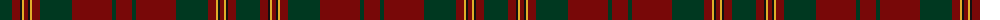

The parent of this is [Livingstone (Australia) NSW](/tartans/dg/24/dr8/k2/y2/dr4/k2/y2/dr8/dg32/dr40/dg4/dr/16/)

This was sourced from register-of-tartans.  It is a [12 stripes tartan](/stripes/stripes12/).

Original link https://www.tartanregister.gov.uk/tartanDetails.aspx?ref=10051

## Thread count
DG/24 DR8 K2 Y2 DR4 K2 Y2 DR8 DG32 DR40 DG4 DR/16

## Palette
Each colour and its ΔE from the base-6 reference it is a variant of.

| Colour | Shade | Base | ΔE (OKLab) |
|---|---|---|---|
| DG |  `#003820` | G  | 0.16 |
| DR |  `#780808` | R  | 0.17 |
| K |  `#101010` | K  | 0.17 |
| Y |  `#E1AD29` | Y  | 0.05 |

ID: /variants/dg/24/dr8/k2/y2/dr4/k2/y2/dr8/dg32/dr40/dg4/dr/16-dg003820-dr780808-k101010-ye1ad29/
