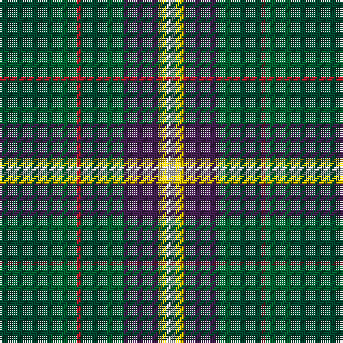

The parent of this is [Connelly Tartan Tartan Number: 9090. Earliest known date: 2009 November Designed by James Connelly for his daughters wedding in April 2010, with the help of The Tartan Shop of Comrie in Perthshire. The different shades of green signify the gaelic families from which the surname derives, the original spelling being O'Conghalie. Purple denotes the thistle, the national flower of Scotland and the O'Conghalies' move to a new country. The gold is a reminder to show generosity and kindness to others. White signifies, knowledge, loyalty, and integrity. The red, which runs through all of the above colours, symbolises the courage to maintain these standards. See products available Copyright © Blair Urquhart, Comrie, 2015](/tartans/dg/24/g12/r2/dg12/g8/dp16/y4/ln/4/)

This was sourced from house-of-tartan.  It is a [8 stripes tartan](/stripes/stripes8/).

Original link http://www.house-of-tartan.scotland.net/house/TartanViewjs.asp?colr=Def&tnam=9090

## Thread count
DG/24 G12 R2 DG12 G8 DP16 Y4 LN/4

## Palette
Each colour and its ΔE from the base-6 reference it is a variant of.

| Colour | Shade | Base | ΔE (OKLab) |
|---|---|---|---|
| DG |  `#004830` | G  | 0.11 |
| DP |  `#442050` | B  | 0.12 |
| G |  `#006430` | G  | 0.04 |
| LN |  `#E8E8E8` | W  | 0.04 |
| R |  `#BC1828` | R  | 0.03 |
| Y |  `#F0C400` | Y  | 0.02 |

# Sample pattern

ID: /variants/dg/24/g12/r2/dg12/g8/dp16/y4/ln/4-dg004830-dp442050-g006430-lne8e8e8-rbc1828-yf0c400/
