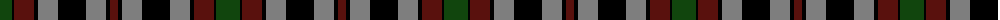

The parent of this is [Borthwick D](/tartans/dg/24/k2/dr20/k4/n20/k28/n20/k4/dr/8/)

This was sourced from weddslist.  It is a [9 stripes tartan](/stripes/stripes9/).

Original link http://www.weddslist.com/cgi-bin/tartans/pg.pl?source=x

## Thread count
DG/24 K2 DR20 K4 N20 K28 N20 K4 DR/8

## Palette
Each colour and its ΔE from the base-6 reference it is a variant of.

| Colour | Shade | Base | ΔE (OKLab) |
|---|---|---|---|
| DG |  `#11450D` | G  | 0.10 |
| DR |  `#59110D` | B  | 0.21 |
| K |  `#000000` | K  | 0.00 |
| N |  `#7E7E7E` | G  | 0.22 |

ID: /variants/dg/24/k2/dr20/k4/n20/k28/n20/k4/dr/8-dg11450d-dr59110d-k000000-n7e7e7e/
