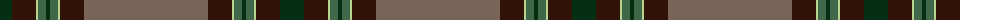

The parent of this is [Roast Den, The](/tartans/dg/24/k24/lg2/na8/dg4/na8/lg2/k24/n/124/)

This was sourced from register-of-tartans.  It is a [9 stripes tartan](/stripes/stripes9/).

Original link https://www.tartanregister.gov.uk/tartanDetails.aspx?ref=11256

## Thread count
DG/24 K24 LG2 Na8 DG4 Na8 LG2 K24 N/124

## Palette
Each colour and its ΔE from the base-6 reference it is a variant of.

| Colour | Shade | Base | ΔE (OKLab) |
|---|---|---|---|
| DG |  `#052F14` | G  | 0.19 |
| K |  `#321308` | B  | 0.23 |
| LG |  `#B7D38B` | Y  | 0.10 |
| N |  `#786557` | G  | 0.17 |
| Na |  `#3F6748` | G  | 0.09 |

ID: /variants/dg/24/k24/lg2/na8/dg4/na8/lg2/k24/n/124-dg052f14-k321308-lgb7d38b-n786557-na3f6748/
