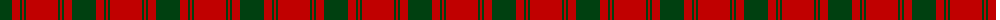

The parent of this is [MacQuarrie 7](/tartans/dg/24/r8/dg2/r2/dg2/r/32/)

This was sourced from weddslist.  It is a [6 stripes tartan](/stripes/stripes6/).

Original link http://www.weddslist.com/cgi-bin/tartans/pg.pl?source=sts

## Thread count
DG/24 R8 DG2 R2 DG2 R/32

## Palette
Each colour and its ΔE from the base-6 reference it is a variant of.

| Colour | Shade | Base | ΔE (OKLab) |
|---|---|---|---|
| DG |  `#004010` | G  | 0.12 |
| R |  `#C00000` | R  | 0.02 |

# Sample pattern

ID: /variants/dg/24/r8/dg2/r2/dg2/r/32-dg004010-rc00000/
