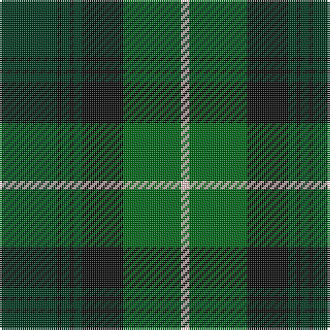

The parent of this is [Manor (Corporate)](/tartans/dg/28/k2/dg4/k2/dg4/k20/g28/lr/4/)

This was sourced from tartans-authority.  It is a [8 stripes tartan](/stripes/stripes8/).

Original link http://www.tartansauthority.com/tartan-ferret/display/8075/

## Thread count
DG/28 K2 DG4 K2 DG4 K20 G28 LR/4

## Palette
Each colour and its ΔE from the base-6 reference it is a variant of.

| Colour | Shade | Base | ΔE (OKLab) |
|---|---|---|---|
| DG |  `#003820` | G  | 0.16 |
| G |  `#006818` | G  | 0.02 |
| K |  `#101010` | K  | 0.17 |
| LR |  `#F4C4C4` | W  | 0.12 |

# Sample pattern

ID: /variants/dg/28/k2/dg4/k2/dg4/k20/g28/lr/4-dg003820-g006818-k101010-lrf4c4c4/
