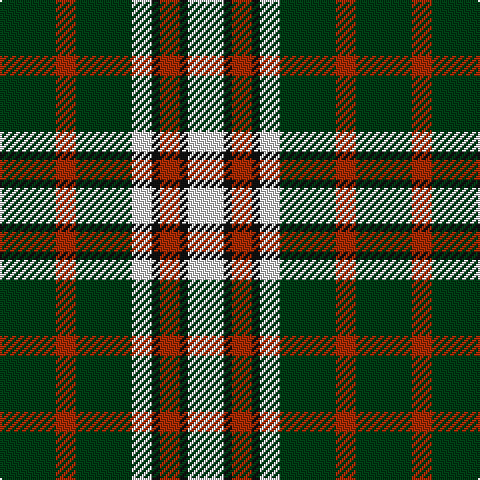

The parent of this is [Unnamed (Hip Flask)](/tartans/dg/28/r10/dg28/ln10/k4/r10/k4/ln/18/)

This was sourced from register-of-tartans.  It is a [8 stripes tartan](/stripes/stripes8/).

Original link https://www.tartanregister.gov.uk/tartanDetails.aspx?ref=4410

## Thread count
DG/28 R10 DG28 LN10 K4 R10 K4 LN/18

## Palette
Each colour and its ΔE from the base-6 reference it is a variant of.

| Colour | Shade | Base | ΔE (OKLab) |
|---|---|---|---|
| DG |  `#003C14` | G  | 0.14 |
| K |  `#101010` | K  | 0.17 |
| LN |  `#E0E0E0` | W  | 0.06 |
| R |  `#A52B05` | R  | 0.07 |

# Sample pattern

ID: /variants/dg/28/r10/dg28/ln10/k4/r10/k4/ln/18-dg003c14-k101010-lne0e0e0-ra52b05/
