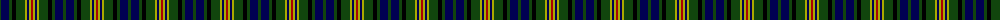

The parent of this is [Maitland](/tartans/dg/3/db8/dg3/k4/dg9/lg2/db2/lg2/dr/2/)

This was sourced from weddslist.  It is a [9 stripes tartan](/stripes/stripes9/).

Original link http://www.weddslist.com/cgi-bin/tartans/pg.pl?source=x

## Thread count
DG/3 DB8 DG3 K4 DG9 LG2 DB2 LG2 DR/2

## Palette
Each colour and its ΔE from the base-6 reference it is a variant of.

| Colour | Shade | Base | ΔE (OKLab) |
|---|---|---|---|
| DB |  `#000052` | B  | 0.20 |
| DG |  `#11450D` | G  | 0.10 |
| DR |  `#AA0000` | R  | 0.06 |
| K |  `#000000` | K  | 0.00 |
| LG |  `#AAAA00` | Y  | 0.11 |

ID: /variants/dg/3/db8/dg3/k4/dg9/lg2/db2/lg2/dr/2-db000052-dg11450d-draa0000-k000000-lgaaaa00/
