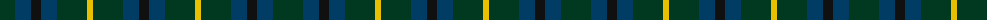

The parent of this is [Robert Dewar Name Tartan Tartan Number: 10006. Earliest known date: 2009 Designed by Neil Dewar for his wedding in July 2009. Three kilt were ordered. The tartan was based on the Dewar Highlander corporate tartan which is often taken to be the clan tartan. This pattern puts the yellow stripe back on the green in a traditional format. See products available Copyright © Blair Urquhart, Comrie, 2015](/tartans/dg/30/db16/k10/db16/dg30/y6/dg30/db16/k/10/)

This was sourced from house-of-tartan.  It is a [9 stripes tartan](/stripes/stripes9/).

Original link http://www.house-of-tartan.scotland.net/house/TartanViewjs.asp?colr=Def&tnam=10006

## Thread count
DG/30 DB16 K10 DB16 DG30 Y6 DG30 DB16 K/10

## Palette
Each colour and its ΔE from the base-6 reference it is a variant of.

| Colour | Shade | Base | ΔE (OKLab) |
|---|---|---|---|
| DB |  `#003C64` | B  | 0.07 |
| DG |  `#003820` | G  | 0.16 |
| K |  `#101010` | K  | 0.17 |
| Y |  `#E8C000` | Y  | 0.00 |

ID: /variants/dg/30/db16/k10/db16/dg30/y6/dg30/db16/k/10-db003c64-dg003820-k101010-ye8c000/
