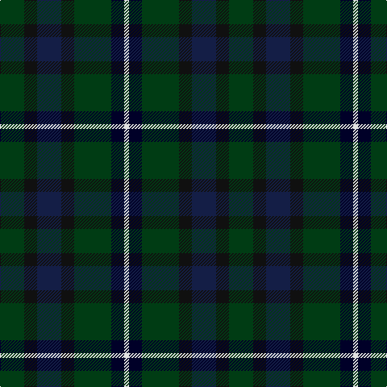

The parent of this is [Marchant](/tartans/dg/30/k16/db30/k16/dg46/dba16/ln/6/)

This was sourced from register-of-tartans.  It is a [7 stripes tartan](/stripes/stripes7/).

Original link https://www.tartanregister.gov.uk/tartanDetails.aspx?ref=5868

## Thread count
DG/30 K16 DB30 K16 DG46 DBa16 LN/6

## Palette
Each colour and its ΔE from the base-6 reference it is a variant of.

| Colour | Shade | Base | ΔE (OKLab) |
|---|---|---|---|
| DB |  `#141E46` | B  | 0.15 |
| DBa |  `#000028` | K  | 0.15 |
| DG |  `#003C14` | G  | 0.14 |
| K |  `#101010` | K  | 0.17 |
| LN |  `#E0E0E0` | W  | 0.06 |

# Sample pattern

ID: /variants/dg/30/k16/db30/k16/dg46/dba16/ln/6-db141e46-dba000028-dg003c14-k101010-lne0e0e0/
