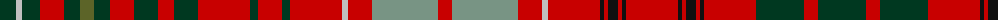

The parent of this is [Kinnoull](/tartans/dg/32/n6/dg18/r24/dg16/g14/dg16/r24/dg24/r16/dg24/r52/dg8/r24/dg8/r52/n6/r24/lg66/r14/lg66/r24/n6/r52/k4/r4/k10/r4/k4/r52/k4/r4/k10/r4/k4/r52/dg48/r14/dg48/r14/dg48/r52/k4/r4/k10/r4/k4/r52/k4/r4/k10/r4/k4/r52/n6/r24/lg66/r14/lg66/r24/n6/r52/dg8/r24/dg8/r52/dg24/r16/dg24/r24/dg16/g14/dg16/r24/dg18/n6/dg32/n/4/)

This was sourced from register-of-tartans.  It is a [78 stripes tartan](/stripes/stripes78/).

Original link https://www.tartanregister.gov.uk/tartanDetails.aspx?ref=1995

## Thread count
DG/32 N6 DG18 R24 DG16 G14 DG16 R24 DG24 R16 DG24 R52 DG8 R24 DG8 R52 N6 R24 LG66 R14 LG66 R24 N6 R52 K4 R4 K10 R4 K4 R52 K4 R4 K10 R4 K4 R52 DG48 R14 DG48 R14 DG48 R52 K4 R4 K10 R4 K4 R52 K4 R4 K10 R4 K4 R52 N6 R24 LG66 R14 LG66 R24 N6 R52 DG8 R24 DG8 R52 DG24 R16 DG24 R24 DG16 G14 DG16 R24 DG18 N6 DG32 N/4

## Palette
Each colour and its ΔE from the base-6 reference it is a variant of.

| Colour | Shade | Base | ΔE (OKLab) |
|---|---|---|---|
| DG |  `#003820` | G  | 0.16 |
| G |  `#5C6428` | G  | 0.09 |
| K |  `#101010` | K  | 0.17 |
| LG |  `#789484` | G  | 0.23 |
| N |  `#C0C0C0` | W  | 0.16 |
| R |  `#C80000` | R  | 0.00 |

ID: /variants/dg/32/n6/dg18/r24/dg16/g14/dg16/r24/dg24/r16/dg24/r52/dg8/r24/dg8/r52/n6/r24/lg66/r14/lg66/r24/n6/r52/k4/r4/k10/r4/k4/r52/k4/r4/k10/r4/k4/r52/dg48/r14/dg48/r14/dg48/r52/k4/r4/k10/r4/k4/r52/k4/r4/k10/r4/k4/r52/n6/r24/lg66/r14/lg66/r24/n6/r52/dg8/r24/dg8/r52/dg24/r16/dg24/r24/dg16/g14/dg16/r24/dg18/n6/dg32/n/4-dg003820-g5c6428-k101010-lg789484-nc0c0c0-rc80000/
