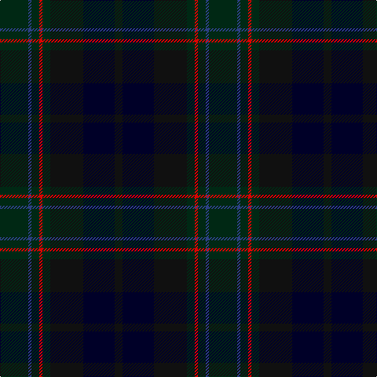

The parent of this is [MacRae, Special Hunting](/tartans/dg/36/b4/dg10/r4/dg10/k42/db40/k/10/)

This was sourced from register-of-tartans.  It is a [8 stripes tartan](/stripes/stripes8/).

Original link https://www.tartanregister.gov.uk/tartanDetails.aspx?ref=2756

## Thread count
DG/36 B4 DG10 R4 DG10 K42 DB40 K/10

## Palette
Each colour and its ΔE from the base-6 reference it is a variant of.

| Colour | Shade | Base | ΔE (OKLab) |
|---|---|---|---|
| B |  `#2C4084` | B  | 0.00 |
| DB |  `#000028` | K  | 0.15 |
| DG |  `#002814` | B  | 0.21 |
| K |  `#101010` | K  | 0.17 |
| R |  `#DC0000` | R  | 0.04 |

# Sample pattern

ID: /variants/dg/36/b4/dg10/r4/dg10/k42/db40/k/10-b2c4084-db000028-dg002814-k101010-rdc0000/
