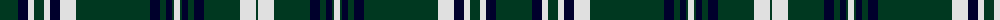

The parent of this is [MacPerl (Personal)](/tartans/dg/36/db10/ln6/dg2/dga6/dg2/ln6/db10/lna16/dga2/dg36/dg36/db10/dg2/dga2/dg2/db6/dga2/ln6/dga2/db6/dg2/dga2/dg2/db10/dg36/lna16/dga/2/)

This was sourced from tartans-authority.  It is a [28 stripes tartan](/stripes/stripes28/).

Original link http://www.tartansauthority.com/tartan-ferret/display/10122/

## Thread count
DG/36 DB10 LN6 DG2 DGa6 DG2 LN6 DB10 LNa16 DGa2 DG36 DG36 DB10 DG2 DGa2 DG2 DB6 DGa2 LN6 DGa2 DB6 DG2 DGa2 DG2 DB10 DG36 LNa16 DGa/2

## Palette
Each colour and its ΔE from the base-6 reference it is a variant of.

| Colour | Shade | Base | ΔE (OKLab) |
|---|---|---|---|
| DB |  `#00002C` | K  | 0.16 |
| DG |  `#003820` | G  | 0.16 |
| DGa |  `#003820` | G  | 0.16 |
| LN |  `#E0E0E0` | W  | 0.06 |
| LNa |  `#E0E0E0` | W  | 0.06 |

ID: /variants/dg/36/db10/ln6/dg2/dga6/dg2/ln6/db10/lna16/dga2/dg36/dg36/db10/dg2/dga2/dg2/db6/dga2/ln6/dga2/db6/dg2/dga2/dg2/db10/dg36/lna16/dga/2-db00002c-dg003820-dga003820-lne0e0e0-lnae0e0e0/
