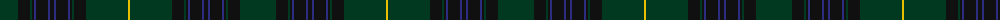

The parent of this is [Grand Lodge of Scotland Corporate Weavers Tartan Tartan Number: 5776. Earliest known date: 2002 This is not a general Masonic tartan but one designed for the Grand Lodge of Scotland which is custodian to the oldest Lodge Minutes in the world dating from 1599. Masons in other parts of the world wishing to obtain this tartan must, in the first instance, contact the Curator of the Grand Lodge of Scotland Museum, Robert L D Cooper See products available Copyright © Blair Urquhart, Comrie, 2015](/tartans/dg/36/k12/dg2/k2/db2/k12/db2/k4/db2/k12/db2/k2/dg2/k12/dg42/y/2/)

This was sourced from house-of-tartan.  It is a [16 stripes tartan](/stripes/stripes16/).

Original link http://www.house-of-tartan.scotland.net/house/TartanViewjs.asp?colr=Def&tnam=5776

## Thread count
DG/36 K12 DG2 K2 DB2 K12 DB2 K4 DB2 K12 DB2 K2 DG2 K12 DG42 Y/2

## Palette
Each colour and its ΔE from the base-6 reference it is a variant of.

| Colour | Shade | Base | ΔE (OKLab) |
|---|---|---|---|
| DB |  `#2C2C80` | B  | 0.05 |
| DG |  `#003820` | G  | 0.16 |
| K |  `#101010` | K  | 0.17 |
| Y |  `#E8C000` | Y  | 0.00 |

ID: /variants/dg/36/k12/dg2/k2/db2/k12/db2/k4/db2/k12/db2/k2/dg2/k12/dg42/y/2-db2c2c80-dg003820-k101010-ye8c000/
