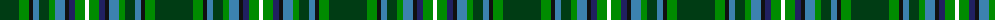

The parent of this is [MacLean, Kenneth, baron of Denboig (Personal)](/tartans/dg/38/g10/k4/b6/dg10/g6/b10/k4/db6/g10/w/4/)

This was sourced from register-of-tartans.  It is a [11 stripes tartan](/stripes/stripes11/).

Original link https://www.tartanregister.gov.uk/tartanDetails.aspx?ref=11201

## Thread count
DG/38 G10 K4 B6 DG10 G6 B10 K4 DB6 G10 W/4

## Palette
Each colour and its ΔE from the base-6 reference it is a variant of.

| Colour | Shade | Base | ΔE (OKLab) |
|---|---|---|---|
| B |  `#3C82AF` | B  | 0.20 |
| DB |  `#202060` | B  | 0.11 |
| DG |  `#003C14` | G  | 0.14 |
| G |  `#008B00` | G  | 0.12 |
| K |  `#101010` | K  | 0.17 |
| N |  `#C0C0C0` | W  | 0.16 |
| W |  `#FFFFFF` | W  | 0.03 |

ID: /variants/dg/38/g10/k4/b6/dg10/g6/b10/k4/db6/g10/w/4-b3c82af-db202060-dg003c14-g008b00-k101010-nc0c0c0-wffffff/
