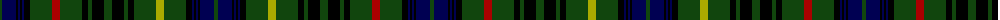

The parent of this is [Stewart Hunting](/tartans/dg/4/db14/k2/db2/k2/db2/k6/dg22/dr8/dg22/k6/dg4/k12/dg8/k12/dg4/k6/dg22/lg8/dg22/k6/db2/k2/db2/k2/db14/dg/4/)

This was sourced from weddslist.  It is a [27 stripes tartan](/stripes/stripes27/).

Original link http://www.weddslist.com/cgi-bin/tartans/pg.pl?source=x

## Thread count
DG/4 DB14 K2 DB2 K2 DB2 K6 DG22 DR8 DG22 K6 DG4 K12 DG8 K12 DG4 K6 DG22 LG8 DG22 K6 DB2 K2 DB2 K2 DB14 DG/4

## Palette
Each colour and its ΔE from the base-6 reference it is a variant of.

| Colour | Shade | Base | ΔE (OKLab) |
|---|---|---|---|
| DB |  `#000052` | B  | 0.20 |
| DG |  `#11450D` | G  | 0.10 |
| DR |  `#AA0000` | R  | 0.06 |
| K |  `#000000` | K  | 0.00 |
| LG |  `#AAAA00` | Y  | 0.11 |

ID: /variants/dg/4/db14/k2/db2/k2/db2/k6/dg22/dr8/dg22/k6/dg4/k12/dg8/k12/dg4/k6/dg22/lg8/dg22/k6/db2/k2/db2/k2/db14/dg/4-db000052-dg11450d-draa0000-k000000-lgaaaa00/
