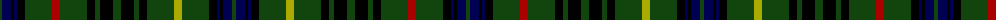

The parent of this is [Stewart Hunting Early](/tartans/dg/4/db9/k3/db3/k8/dg27/dr8/dg27/k8/dg5/k13/dg8/k13/dg5/k8/dg27/lg8/dg27/k8/db3/k3/db9/dg/4/)

This was sourced from weddslist.  It is a [23 stripes tartan](/stripes/stripes23/).

Original link http://www.weddslist.com/cgi-bin/tartans/pg.pl?source=x

## Thread count
DG/4 DB9 K3 DB3 K8 DG27 DR8 DG27 K8 DG5 K13 DG8 K13 DG5 K8 DG27 LG8 DG27 K8 DB3 K3 DB9 DG/4

## Palette
Each colour and its ΔE from the base-6 reference it is a variant of.

| Colour | Shade | Base | ΔE (OKLab) |
|---|---|---|---|
| DB |  `#000052` | B  | 0.20 |
| DG |  `#11450D` | G  | 0.10 |
| DR |  `#AA0000` | R  | 0.06 |
| K |  `#000000` | K  | 0.00 |
| LG |  `#AAAA00` | Y  | 0.11 |

ID: /variants/dg/4/db9/k3/db3/k8/dg27/dr8/dg27/k8/dg5/k13/dg8/k13/dg5/k8/dg27/lg8/dg27/k8/db3/k3/db9/dg/4-db000052-dg11450d-draa0000-k000000-lgaaaa00/
