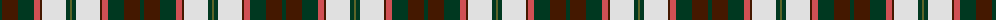
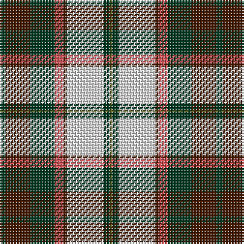

The parent of this is [National Trust Corporate Tartan Tartan Number: 2117. Earliest known date: pre 1991 Sent in by Tweedmill for information. See products available Copyright © Blair Urquhart, Comrie, 2015](/tartans/dg/4/dr16/dg16/do6/dr2/ln24/dg4/g/2/)

This was sourced from house-of-tartan.  It is a [8 stripes tartan](/stripes/stripes8/).

Original link http://www.house-of-tartan.scotland.net/house/TartanViewjs.asp?colr=Def&tnam=2117

## Thread count
DG/4 DR16 DG16 DO6 DR2 LN24 DG4 G/2

## Palette
Each colour and its ΔE from the base-6 reference it is a variant of.

| Colour | Shade | Base | ΔE (OKLab) |
|---|---|---|---|
| DG |  `#003820` | G  | 0.16 |
| DO |  `#D05054` | R  | 0.10 |
| DR |  `#441800` | B  | 0.22 |
| G |  `#5C6428` | G  | 0.09 |
| LN |  `#E0E0E0` | W  | 0.06 |

# Sample pattern

ID: /variants/dg/4/dr16/dg16/do6/dr2/ln24/dg4/g/2-dg003820-dod05054-dr441800-g5c6428-lne0e0e0/
