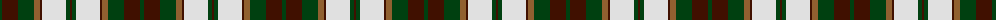

The parent of this is [National Trust](/tartans/dg/4/dr16/dg16/lt6/dr2/ln24/dg4/dr/2/)

This was sourced from weddslist.  It is a [8 stripes tartan](/stripes/stripes8/).

Original link http://www.weddslist.com/cgi-bin/tartans/pg.pl?source=sts

## Thread count
DG/4 DR16 DG16 LT6 DR2 LN24 DG4 DR/2

## Palette
Each colour and its ΔE from the base-6 reference it is a variant of.

| Colour | Shade | Base | ΔE (OKLab) |
|---|---|---|---|
| DG |  `#004010` | G  | 0.12 |
| DR |  `#401000` | B  | 0.23 |
| LN |  `#E0E0E0` | W  | 0.06 |
| LT |  `#906030` | R  | 0.15 |

# Sample pattern

ID: /variants/dg/4/dr16/dg16/lt6/dr2/ln24/dg4/dr/2-dg004010-dr401000-lne0e0e0-lt906030/
