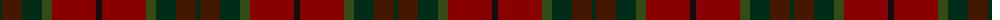

The parent of this is [Rowardennan](/tartans/dg/4/dr20/dg20/g10/dra44/k/6/)

This was sourced from register-of-tartans.  It is a [6 stripes tartan](/stripes/stripes6/).

Original link https://www.tartanregister.gov.uk/tartanDetails.aspx?ref=3581

## Thread count
DG/4 DR20 DG20 G10 DRa44 K/6

## Palette
Each colour and its ΔE from the base-6 reference it is a variant of.

| Colour | Shade | Base | ΔE (OKLab) |
|---|---|---|---|
| DG |  `#002C18` | G  | 0.20 |
| DR |  `#441800` | B  | 0.22 |
| DRa |  `#880000` | R  | 0.14 |
| G |  `#344C14` | G  | 0.08 |
| K |  `#101010` | K  | 0.17 |

# Sample pattern

ID: /variants/dg/4/dr20/dg20/g10/dra44/k/6-dg002c18-dr441800-dra880000-g344c14-k101010/
