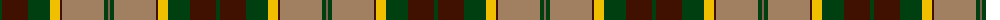

The parent of this is [St Lawrence Trade](/tartans/dg/4/dr26/dg22/y10/dr2/lt42/dg4/lta/2/)

This was sourced from weddslist.  It is a [8 stripes tartan](/stripes/stripes8/).

Original link http://www.weddslist.com/cgi-bin/tartans/pg.pl?source=sts

## Thread count
DG/4 DR26 DG22 Y10 DR2 LT42 DG4 LTa/2

## Palette
Each colour and its ΔE from the base-6 reference it is a variant of.

| Colour | Shade | Base | ΔE (OKLab) |
|---|---|---|---|
| DG |  `#004010` | G  | 0.12 |
| DR |  `#401000` | B  | 0.23 |
| LT |  `#A08060` | R  | 0.20 |
| LTa |  `#806050` | R  | 0.17 |
| Y |  `#F0C000` | Y  | 0.01 |

# Sample pattern

ID: /variants/dg/4/dr26/dg22/y10/dr2/lt42/dg4/lta/2-dg004010-dr401000-lta08060-lta806050-yf0c000/
