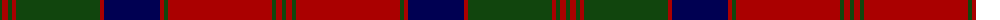

The parent of this is [MacQuarrie 1815](/tartans/dg/4/dr6/dg4/dr4/dg84/dr4/db56/dr4/dg4/dr104/dg4/dr6/dg/4/)

This was sourced from weddslist.  It is a [13 stripes tartan](/stripes/stripes13/).

Original link http://www.weddslist.com/cgi-bin/tartans/pg.pl?source=tinsel

## Thread count
DG/4 DR6 DG4 DR4 DG84 DR4 DB56 DR4 DG4 DR104 DG4 DR6 DG/4

## Palette
Each colour and its ΔE from the base-6 reference it is a variant of.

| Colour | Shade | Base | ΔE (OKLab) |
|---|---|---|---|
| DB |  `#000052` | B  | 0.20 |
| DG |  `#11450D` | G  | 0.10 |
| DR |  `#AA0000` | R  | 0.06 |

ID: /variants/dg/4/dr6/dg4/dr4/dg84/dr4/db56/dr4/dg4/dr104/dg4/dr6/dg/4-db000052-dg11450d-draa0000/
