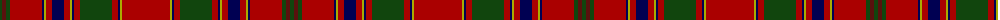

The parent of this is [Munro](/tartans/dg/4/dra4/dg4/dr32/db2/lg2/dr6/db12/dr6/lg2/db2/dr6/dg32/dr6/db2/lg2/dr/48/)

This was sourced from weddslist.  It is a [17 stripes tartan](/stripes/stripes17/).

Original link http://www.weddslist.com/cgi-bin/tartans/pg.pl?source=x

## Thread count
DG/4 DRa4 DG4 DR32 DB2 LG2 DR6 DB12 DR6 LG2 DB2 DR6 DG32 DR6 DB2 LG2 DR/48

## Palette
Each colour and its ΔE from the base-6 reference it is a variant of.

| Colour | Shade | Base | ΔE (OKLab) |
|---|---|---|---|
| DB |  `#000052` | B  | 0.20 |
| DG |  `#11450D` | G  | 0.10 |
| DR |  `#AA0000` | R  | 0.06 |
| DRa |  `#59110D` | B  | 0.21 |
| LG |  `#AAAA00` | Y  | 0.11 |

ID: /variants/dg/4/dra4/dg4/dr32/db2/lg2/dr6/db12/dr6/lg2/db2/dr6/dg32/dr6/db2/lg2/dr/48-db000052-dg11450d-draa0000-dra59110d-lgaaaa00/
