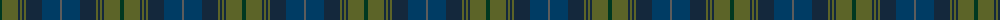

The parent of this is [Cowal Highland Gathering (Corporate)](/tartans/dg/4/g16/dn2/g2/dn2/g2/dn16/db18/n/2/)

This was sourced from tartans-authority.  It is a [9 stripes tartan](/stripes/stripes9/).

Original link http://www.tartansauthority.com/tartan-ferret/display/2536/

## Thread count
DG/4 G16 DN2 G2 DN2 G2 DN16 DB18 N/2

## Palette
Each colour and its ΔE from the base-6 reference it is a variant of.

| Colour | Shade | Base | ΔE (OKLab) |
|---|---|---|---|
| DB |  `#003C64` | B  | 0.07 |
| DG |  `#003820` | G  | 0.16 |
| DN |  `#14283C` | B  | 0.14 |
| G |  `#5C6428` | G  | 0.09 |
| N |  `#5C5C5C` | B  | 0.14 |

ID: /variants/dg/4/g16/dn2/g2/dn2/g2/dn16/db18/n/2-db003c64-dg003820-dn14283c-g5c6428-n5c5c5c/
