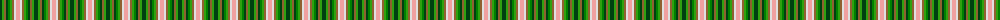

The parent of this is [Stirling](/tartans/dg/4/g2/lt2/dg2/ga2/g2/lt2/ln2/lr/4/)

This was sourced from weddslist.  It is a [9 stripes tartan](/stripes/stripes9/).

Original link http://www.weddslist.com/cgi-bin/tartans/pg.pl?source=sts

## Thread count
DG/4 G2 LT2 DG2 Ga2 G2 LT2 LN2 LR/4

## Palette
Each colour and its ΔE from the base-6 reference it is a variant of.

| Colour | Shade | Base | ΔE (OKLab) |
|---|---|---|---|
| DG |  `#004010` | G  | 0.12 |
| G |  `#30A010` | G  | 0.19 |
| Ga |  `#008000` | G  | 0.09 |
| LN |  `#E0E0E0` | W  | 0.06 |
| LR |  `#F0A0A0` | Y  | 0.17 |
| LT |  `#906030` | R  | 0.15 |

ID: /variants/dg/4/g2/lt2/dg2/ga2/g2/lt2/ln2/lr/4-dg004010-g30a010-ga008000-lne0e0e0-lrf0a0a0-lt906030/
