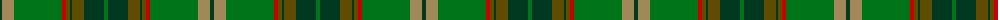

The parent of this is [Fitzgibbon (Name)](/tartans/dg/4/lt12/g48/r4/t4/dg2/t12/dg20/g/4/)

This was sourced from tartans-authority.  It is a [9 stripes tartan](/stripes/stripes9/).

Original link http://www.tartansauthority.com/tartan-ferret/display/6919/

## Thread count
DG/4 LT12 G48 R4 T4 DG2 T12 DG20 G/4

## Palette
Each colour and its ΔE from the base-6 reference it is a variant of.

| Colour | Shade | Base | ΔE (OKLab) |
|---|---|---|---|
| DG |  `#003820` | G  | 0.16 |
| G |  `#007418` | G  | 0.05 |
| LT |  `#A08858` | Y  | 0.21 |
| R |  `#C80000` | R  | 0.00 |
| T |  `#604C00` | G  | 0.12 |

ID: /variants/dg/4/lt12/g48/r4/t4/dg2/t12/dg20/g/4-dg003820-g007418-lta08858-rc80000-t604c00/
