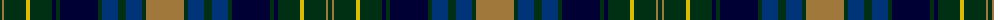

The parent of this is [Eildon (Fashion)](/tartans/dg/4/lt2/dg22/y4/dg22/db4/dg4/db38/dg4/dba16/dg8/dba16/dg4/lt/38/)

This was sourced from tartans-authority.  It is a [14 stripes tartan](/stripes/stripes14/).

Original link http://www.tartansauthority.com/tartan-ferret/display/4800/

## Thread count
DG/4 LT2 DG22 Y4 DG22 DB4 DG4 DB38 DG4 DBa16 DG8 DBa16 DG4 LT/38

## Palette
Each colour and its ΔE from the base-6 reference it is a variant of.

| Colour | Shade | Base | ΔE (OKLab) |
|---|---|---|---|
| DB |  `#000034` | K  | 0.18 |
| DBa |  `#003478` | B  | 0.06 |
| DG |  `#003014` | G  | 0.18 |
| LT |  `#A0783C` | R  | 0.18 |
| Y |  `#DCBC00` | Y  | 0.02 |

ID: /variants/dg/4/lt2/dg22/y4/dg22/db4/dg4/db38/dg4/dba16/dg8/dba16/dg4/lt/38-db000034-dba003478-dg003014-lta0783c-ydcbc00/
