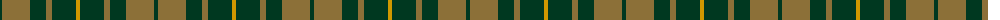
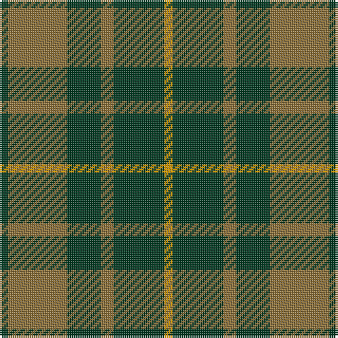

The parent of this is [Confederate Cavalry (Military)](/tartans/dg/4/lt28/dg16/lt6/dg24/dy/4/)

This was sourced from tartans-authority.  It is a [6 stripes tartan](/stripes/stripes6/).

Original link http://www.tartansauthority.com/tartan-ferret/display/4567/

## Thread count
DG/4 LT28 DG16 LT6 DG24 DY/4

## Palette
Each colour and its ΔE from the base-6 reference it is a variant of.

| Colour | Shade | Base | ΔE (OKLab) |
|---|---|---|---|
| DG |  `#003820` | G  | 0.16 |
| DY |  `#D09800` | Y  | 0.11 |
| LT |  `#8C7038` | G  | 0.18 |

# Sample pattern

ID: /variants/dg/4/lt28/dg16/lt6/dg24/dy/4-dg003820-dyd09800-lt8c7038/
