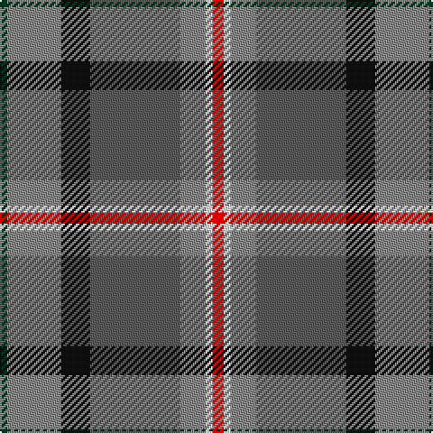

The parent of this is [Allman-Jones (Personal)](/tartans/dg/4/na30/k16/n50/na14/w4/r/6/)

This was sourced from tartans-authority.  It is a [7 stripes tartan](/stripes/stripes7/).

Original link http://www.tartansauthority.com/tartan-ferret/display/10925/

## Thread count
DG/4 Na30 K16 N50 Na14 W4 R/6

## Palette
Each colour and its ΔE from the base-6 reference it is a variant of.

| Colour | Shade | Base | ΔE (OKLab) |
|---|---|---|---|
| DG |  `#003820` | G  | 0.16 |
| K |  `#101010` | K  | 0.17 |
| N |  `#5C5C5C` | B  | 0.14 |
| Na |  `#888888` | R  | 0.24 |
| R |  `#C80000` | R  | 0.00 |
| W |  `#FCFCFC` | W  | 0.03 |

# Sample pattern

ID: /variants/dg/4/na30/k16/n50/na14/w4/r/6-dg003820-k101010-n5c5c5c-na888888-rc80000-wfcfcfc/
