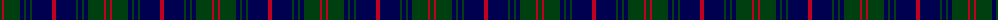

The parent of this is [Barnaby Brown Pibroch](/tartans/dg/4/r2/dg16/db4/dg2/db4/dg2/db20/r/4/)

This was sourced from weddslist.  It is a [9 stripes tartan](/stripes/stripes9/).

Original link http://www.weddslist.com/cgi-bin/tartans/pg.pl?source=sts

## Thread count
DG/4 R2 DG16 DB4 DG2 DB4 DG2 DB20 R/4

## Palette
Each colour and its ΔE from the base-6 reference it is a variant of.

| Colour | Shade | Base | ΔE (OKLab) |
|---|---|---|---|
| DB |  `#000050` | B  | 0.20 |
| DG |  `#004010` | G  | 0.12 |
| R |  `#C00020` | R  | 0.02 |

ID: /variants/dg/4/r2/dg16/db4/dg2/db4/dg2/db20/r/4-db000050-dg004010-rc00020/
