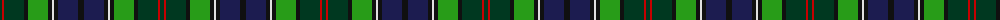

The parent of this is [Rutledge (Name)](/tartans/dg/4/r2/dg20/k4/g20/k4/ln2/k4/db20/k/6/)

This was sourced from tartans-authority.  It is a [10 stripes tartan](/stripes/stripes10/).

Original link http://www.tartansauthority.com/tartan-ferret/display/4019/

## Thread count
DG/4 R2 DG20 K4 G20 K4 LN2 K4 DB20 K/6

## Palette
Each colour and its ΔE from the base-6 reference it is a variant of.

| Colour | Shade | Base | ΔE (OKLab) |
|---|---|---|---|
| DB |  `#1C1C50` | B  | 0.14 |
| DG |  `#003820` | G  | 0.16 |
| G |  `#289C18` | G  | 0.18 |
| K |  `#101010` | K  | 0.17 |
| LN |  `#E0E0E0` | W  | 0.06 |
| R |  `#C80000` | R  | 0.00 |

ID: /variants/dg/4/r2/dg20/k4/g20/k4/ln2/k4/db20/k/6-db1c1c50-dg003820-g289c18-k101010-lne0e0e0-rc80000/
